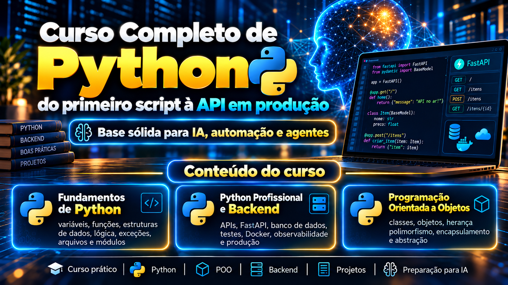

# Python Notes: código dos capítulos



Repositório de código do livro **Python Notes** (júnior, intermediário e avançado).
Cada capítulo tem um arquivo `.py` executável, na mesma ordem em que o código aparece no livro.
O livro em HTML está em `docs/python-notes.html`.

## Requisitos

- Python 3.12 ou superior (os arquivos foram executados com Python 3.12.3)
- `pytest` para os capítulos de testes
- Os capítulos 52 a 61 (backend) usam bibliotecas de terceiros. Instale-as de uma vez com `uv sync --group backend`
- O PostgreSQL só é necessário se você quiser executar por conta própria os blocos marcados como "Com PostgreSQL" (os arquivos `.py` dos capítulos rodam sem ele)

## Como rodar

Cada arquivo roda sozinho, a partir da raiz do repositório:

```bash
python3 junior/cap09_variaveis.py
```

No Windows, use `py` no lugar de `python3`. Com uv, sem instalar nada antes:

```bash
uv run junior/cap09_variaveis.py
```

Alguns capítulos pedem dados no teclado (`input()`), criam arquivos temporários na pasta atual
ou, nos capítulos de concorrência, usam mais de um processo. Os arquivos gerados estão no `.gitignore`.

Para os testes do capítulo de pytest:

```bash
uv sync
uv run pytest intermediario/cap40_pytest.py
```

## Capítulos

### Ambiente

| Cap. | Capítulo | Arquivo |
|---|---|---|
| 1 | O que é Python e como ele executa | `ambiente/cap01_como_executa.py` |
| 2 | Instalando o Python no macOS, Windows e Linux | `ambiente/cap02_instalacao.py` |
| 3 | pyenv: várias versões de Python na mesma máquina | `ambiente/cap03_pyenv.py` |
| 4 | pip e venv: dependências isoladas por projeto | `ambiente/cap04_pip_venv.py` |
| 5 | pipx: ferramentas de linha de comando isoladas | `ambiente/cap05_pipx.py` |
| 6 | Poetry: projetos, dependências e lockfile | `ambiente/cap06_poetry.py` |
| 7 | uv: o gerenciador unificado | (sem arquivo .py) |
| 8 | Qual ferramenta escolher, editor e estrutura de projeto | `ambiente/cap08_estrutura_projeto.py` |
### Júnior

| Cap. | Capítulo | Arquivo |
|---|---|---|
| 9 | Comentários e variáveis | `junior/cap09_variaveis.py` |
| 10 | Tipos de dados | `junior/cap10_tipos.py` |
| 11 | Strings | `junior/cap11_strings.py` |
| 12 | Conversão de tipos e valores falsy | `junior/cap12_conversao_falsy.py` |
| 13 | Entrada, saída e operadores | `junior/cap13_entrada_operadores.py` |
| 14 | Condicionais | `junior/cap14_condicionais.py` |
| 15 | Laços com for | `junior/cap15_laco_for.py` |
| 16 | Laços com while | `junior/cap16_laco_while.py` |
| 17 | Funções | `junior/cap17_funcoes.py` |
| 18 | Escopo e armadilhas das funções | `junior/cap18_escopo.py` |
| 19 | Listas | `junior/cap19_listas.py` |
| 20 | Tuplas e conjuntos | `junior/cap20_tuplas_conjuntos.py` |
| 21 | Dicionários | `junior/cap21_dicionarios.py` |
| 22 | Mutabilidade e identidade | `junior/cap22_mutabilidade.py` |
| 23 | Exceções | `junior/cap23_excecoes.py` |
| 24 | Arquivos e pathlib | `junior/cap24_arquivos.py` |
| 25 | Módulos e importação | `junior/cap25_modulos.py` |
### Intermediário

| Cap. | Capítulo | Arquivo |
|---|---|---|
| 26 | Classes e objetos | `intermediario/cap26_classes.py` |
| 27 | Atributos e métodos | `intermediario/cap27_atributos_metodos.py` |
| 28 | Herança e polimorfismo | `intermediario/cap28_heranca.py` |
| 29 | Encapsulamento e @property | `intermediario/cap29_encapsulamento.py` |
| 30 | Abstração com ABC | `intermediario/cap30_abstracao.py` |
| 31 | Métodos especiais | `intermediario/cap31_dunders.py` |
| 32 | Comprehensions | `intermediario/cap32_comprehensions.py` |
| 33 | Funções de ordem superior | `intermediario/cap33_ordem_superior.py` |
| 34 | Iteradores e geradores | `intermediario/cap34_geradores.py` |
| 35 | Closures e decoradores | `intermediario/cap35_decoradores.py` |
| 36 | dataclasses | `intermediario/cap36_dataclasses.py` |
| 37 | Type hints | `intermediario/cap37_type_hints.py` |
| 38 | Gerenciadores de contexto | `intermediario/cap38_context_managers.py` |
| 39 | Biblioteca padrão essencial | `intermediario/cap39_stdlib.py` |
| 40 | Testes com pytest | `intermediario/cap40_pytest.py` |
| 41 | Logging e linha de comando com argparse | `intermediario/cap41_logging_cli.py` |
### Avançado

| Cap. | Capítulo | Arquivo |
|---|---|---|
| 42 | O modelo de dados e os protocolos | `avancado/cap42_modelo_dados.py` |
| 43 | MRO, super cooperativo e mixins | `avancado/cap43_mro_mixins.py` |
| 44 | Tipagem avançada | `avancado/cap44_tipagem_avancada.py` |
| 45 | Descritores, __slots__ e metaclasses | `avancado/cap45_descritores_slots.py` |
| 46 | Concorrência: GIL, threads e processos | `avancado/cap46_concorrencia.py` |
| 47 | asyncio | `avancado/cap47_assincrono.py` |
| 48 | Desempenho e profiling | `avancado/cap48_desempenho.py` |
| 49 | Empacotamento e estrutura de projeto | `avancado/cap49_empacotamento.py` |
| 50 | Qualidade e automação | `avancado/cap50_qualidade.py` |
| 51 | Arquitetura e erros em produção | `avancado/cap51_arquitetura.py` |
### Backend

| Cap. | Capítulo | Arquivo |
|---|---|---|
| 52 | HTTP e consumo de APIs | `backend/cap52_http_apis.py` |
| 53 | REST e fundamentos de APIs | `backend/cap53_rest_contratos.py` |
| 54 | FastAPI | `backend/cap54_fastapi_basico.py` |
| 55 | PostgreSQL e SQL | `backend/cap55_sql.py` |
| 56 | SQLAlchemy | `backend/cap56_sqlalchemy_orm.py` |
| 57 | Alembic: migrações de banco | (sem arquivo .py) |
| 58 | Configuração profissional | `backend/cap58_configuracao.py` |
| 59 | Testes de aplicações | `backend/cap59_testes_aplicacao.py` |
| 60 | Docker para Python | (sem arquivo .py) |
| 61 | Observabilidade | `backend/cap61_observabilidade.py` |
| 62 | API completa: do contrato ao deploy | (sem arquivo .py) |
### Projetos

| Cap. | Capítulo | Arquivo |
|---|---|---|
| 63 | Projeto Júnior: gerenciador de despesas | (sem arquivo .py) |
| 64 | Projeto Intermediário: CLI de tarefas | (sem arquivo .py) |
| 65 | Projeto Avançado: processador concorrente de dados | (sem arquivo .py) |

## Convenções

- Um arquivo por capítulo, nomeado `capNN_assunto.py`.
- Os comentários `# === Seção ===` repetem os títulos do livro.
- Exemplos de configuração (`pyproject.toml`, CI) e a API completa ficam em `exemplos/`.
- Os três projetos integradores ficam em `projetos/`, cada um com os seus próprios testes.

## Autor

**Alexsander Valente**, Software & AI Architecture, Product Engineering e Data Engineering.

- Site: https://www.alexsander.app
- LinkedIn: https://www.linkedin.com/in/alexsander-valente/
